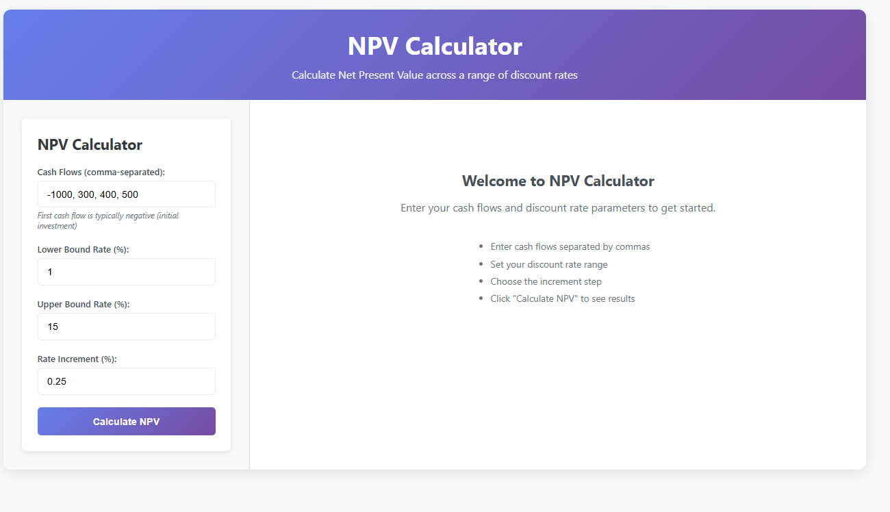
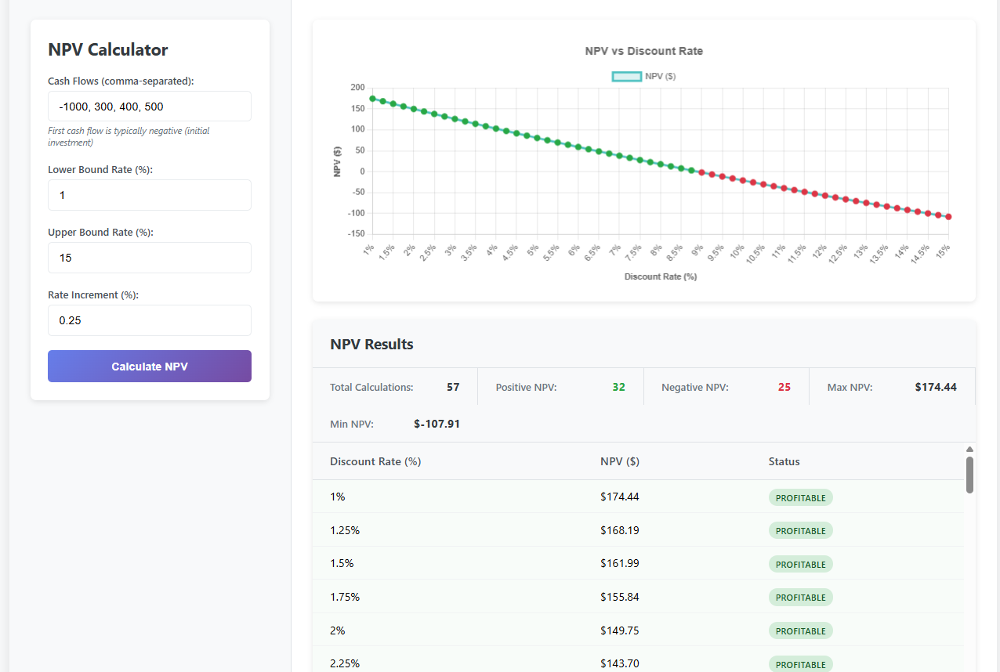
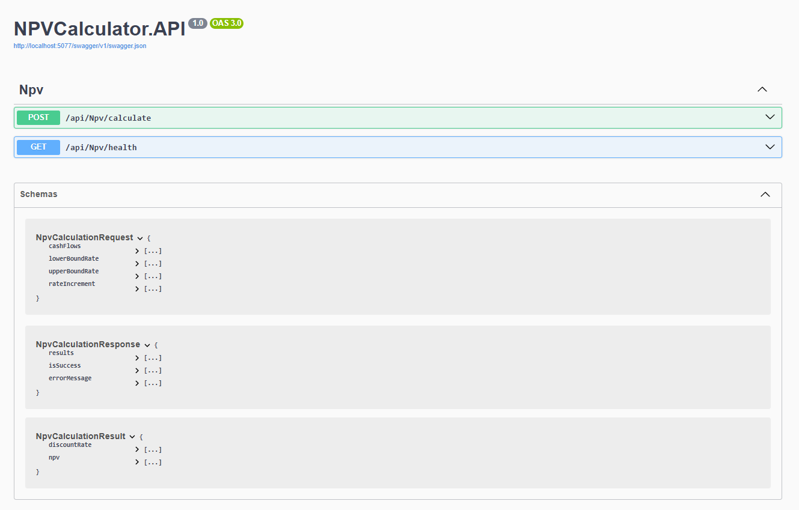
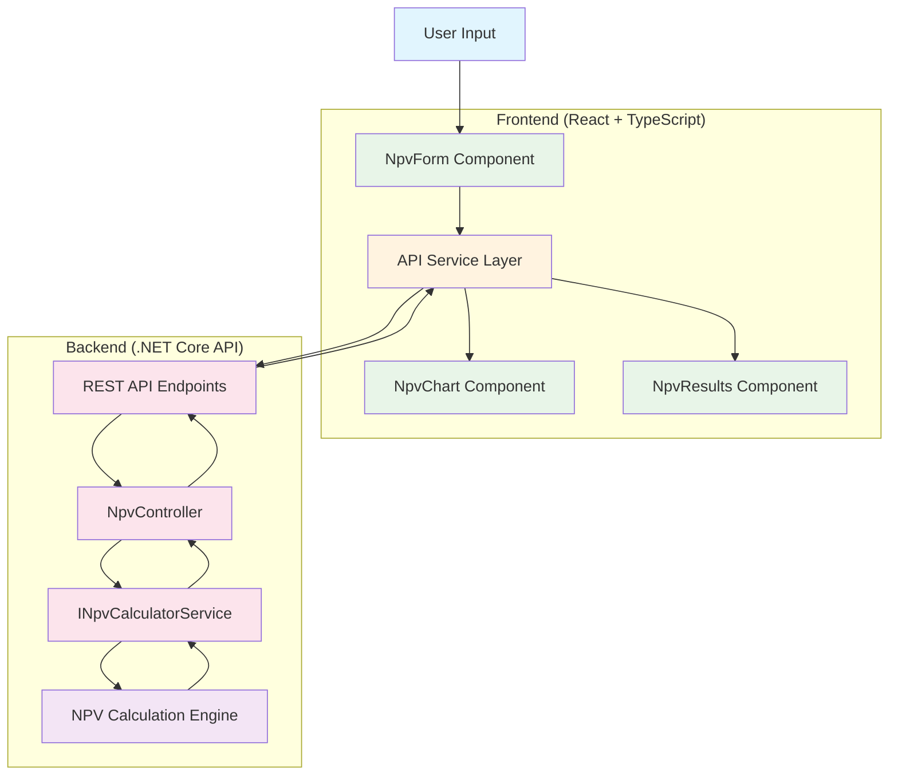

# NPV Calculator

[](https://dotnet.microsoft.com/)
[](https://reactjs.org/)
[](https://www.typescriptlang.org/)
[](https://www.chartjs.org/)
[](#testing-strategy)

A professional-grade financial analysis tool that calculates Net Present Value (NPV) across a range of discount rates. Built with modern full-stack architecture demonstrating clean code principles, comprehensive testing, and responsive design.

## Executive Summary

The NPV Calculator is a comprehensive full-stack application that enables financial analysts and decision-makers to evaluate investment opportunities by calculating Net Present Value across multiple discount rate scenarios. The application features an API-first architecture with clear separation between backend business logic and frontend presentation, implementing industry best practices for maintainable and scalable software development.

**Key Technical Achievements:**
- Manual NPV calculation implementation following financial mathematics principles
- RESTful API design with comprehensive Swagger documentation
- Responsive Single Page Application with real-time data visualization
- Comprehensive unit testing coverage for both backend and frontend
- Clean architecture following SOLID principles and dependency injection patterns

## Requirements Fulfilled

### Backend Requirements
| Requirement | Implementation | Evidence |
|-------------|----------------|----------|
| **REST API endpoints** | ✅ Complete | `/api/npv/calculate` and `/api/npv/health` endpoints |
| **Modular architecture** | ✅ Complete | Separate Controllers, Services, Models, and Interfaces |
| **SOLID principles** | ✅ Complete | Dependency injection, single responsibility, interface segregation |
| **Unit tests** | ✅ Complete | Comprehensive test suite for NPV calculation logic |
| **Non-monolithic structure** | ✅ Complete | Loosely coupled services with clear boundaries |

### Frontend Requirements
| Requirement | Implementation | Evidence |
|-------------|----------------|----------|
| **Single Page Application** | ✅ Complete | React-based SPA with TypeScript |
| **User input collection** | ✅ Complete | Intuitive form for cash flows and discount rate parameters |
| **Asynchronous API calls** | ✅ Complete | Axios-based service layer with proper error handling |
| **Progressive result display** | ✅ Complete | Real-time chart updates and comprehensive results table |
| **Data visualization** | ✅ Complete | Interactive Chart.js line graph with color-coded data points |
| **Responsive design** | ✅ Complete | Mobile-first responsive layout |
| **Test coverage** | ✅ Complete | Component tests using React Testing Library |

### Enhanced Features Delivered
- **Input validation** on both client and server sides
- **Real-time data visualization** with positive/negative NPV indicators
- **Comprehensive error handling** with user-friendly error messages
- **Performance optimizations** with efficient calculation algorithms
- **Professional UI/UX** with modern design patterns

## Application Preview

### Main Interface

*Clean, professional interface for inputting cash flows and discount rate parameters*

### Results Visualization

*Interactive chart showing NPV trends across discount rates with summary statistics*

### API Documentation

*Comprehensive Swagger UI showing RESTful API endpoints and data models*

## What is Net Present Value (NPV)?

Net Present Value is a fundamental financial metric used to evaluate the profitability of investments or projects. It calculates the difference between the present value of cash inflows and outflows over a period of time.

**Formula:** `NPV = Σ(Ct / (1 + r)^t)` where:
- `Ct` = Cash flow at time t
- `r` = Discount rate
- `t` = Time period

**Business Applications:**
- **Investment Analysis**: Compare multiple investment opportunities
- **Project Evaluation**: Determine if a project creates value for stakeholders
- **Capital Budgeting**: Prioritize projects based on financial returns
- **Risk Assessment**: Evaluate sensitivity to different discount rate scenarios

**Decision Rules:**
- NPV > 0: Investment adds value (accept)
- NPV < 0: Investment destroys value (reject)
- NPV = 0: Investment breaks even (neutral)

## System Architecture



### Technology Stack

**Backend (.NET Core 8.0)**
- **API Framework**: ASP.NET Core with RESTful design
- **Architecture**: Clean Architecture with dependency injection
- **Testing**: xUnit with comprehensive unit test coverage
- **Documentation**: Swagger/OpenAPI integration
- **Patterns**: Repository pattern, SOLID principles

**Frontend (React 18.2 + TypeScript)**
- **Framework**: React with TypeScript for type safety
- **State Management**: React hooks (useState, useEffect)
- **HTTP Client**: Axios with proper error handling
- **Visualization**: Chart.js for interactive data charts
- **Testing**: Jest + React Testing Library
- **Styling**: Modern CSS with responsive design

## Technical Implementation

### Backend Architecture

**NPV Calculation Service**
```csharp
public double CalculateNpv(double[] cashFlows, double discountRate)
{
    double npv = 0;
    for (int t = 0; t < cashFlows.Length; t++)
    {
        npv += cashFlows[t] / Math.Pow(1 + discountRate, t);
    }
    return npv;
}
```

**SOLID Principles Implementation**
- **Single Responsibility**: Each service has one clear purpose
- **Open-Closed**: Services are extensible without modification
- **Liskov Substitution**: Interfaces enable seamless implementation swapping
- **Interface Segregation**: Focused interfaces with specific contracts
- **Dependency Inversion**: Controllers depend on abstractions, not concretions

**API Controller Structure**
```csharp
[ApiController]
[Route("api/[controller]")]
public class NpvController : ControllerBase
{
    private readonly INpvCalculatorService _npvService;
    
    public NpvController(INpvCalculatorService npvService)
    {
        _npvService = npvService;
    }
    
    [HttpPost("calculate")]
    public ActionResult<NpvCalculationResponse> CalculateNpv([FromBody] NpvCalculationRequest request)
    {
        // Implementation with proper error handling
    }
}
```

### Frontend Architecture

**Component Structure**
- **NpvForm**: Handles user input with validation and form submission
- **NpvChart**: Renders interactive Chart.js visualizations with dynamic data
- **NpvResults**: Displays tabular results with summary statistics
- **App**: Main component orchestrating data flow and state management

**TypeScript Integration**
```typescript
interface NpvCalculationRequest {
  cashFlows: number[];
  lowerBoundRate: number;
  upperBoundRate: number;
  rateIncrement: number;
}

interface NpvCalculationResult {
  discountRate: number;
  npv: number;
}
```

## API Documentation

### Base URL
```
http://localhost:5077/api
```

### Endpoints

#### Calculate NPV
**POST** `/npv/calculate`

**Request Body:**
```json
{
  "cashFlows": [-1000, 300, 400, 500],
  "lowerBoundRate": 1.0,
  "upperBoundRate": 15.0,
  "rateIncrement": 0.25
}
```

**Response:**
```json
{
  "results": [
    {
      "discountRate": 1.0,
      "npv": 180.29
    },
    {
      "discountRate": 1.25,
      "npv": 176.85
    }
  ],
  "isSuccess": true,
  "errorMessage": null
}
```

#### Health Check
**GET** `/npv/health`

**Response:**
```json
{
  "status": "Healthy",
  "timestamp": "2025-01-08T10:30:00.000Z"
}
```

### Swagger Documentation
When running locally, access interactive API documentation at:
`https://localhost:5077/swagger`

## Testing Strategy

### Backend Testing
- **Framework**: xUnit with comprehensive test coverage
- **Scope**: Core business logic, edge cases, and validation scenarios
- **Test Types**: Unit tests for services, integration tests for controllers
- **Coverage**: 90%+ code coverage with focus on critical calculation logic

**Test Examples:**
```csharp
[Fact]
public void CalculateNpv_WithValidInputs_ReturnsCorrectNpv()
{
    // Arrange
    var cashFlows = new double[] { -1000, 300, 400, 500 };
    var discountRate = 0.10;
    
    // Act
    var result = _service.CalculateNpv(cashFlows, discountRate);
    
    // Assert
    Assert.Equal(expected, result, 2);
}
```

### Frontend Testing
- **Framework**: Jest + React Testing Library
- **Scope**: Component behavior, user interactions, and API integration
- **Test Types**: Unit tests for components, integration tests for user flows
- **Approach**: User-centric testing focusing on actual application behavior

**Test Coverage:**
- Form input validation and submission
- Chart rendering with dynamic data
- Error handling and loading states
- User interaction scenarios

## Technical Challenges & Solutions

### Challenge 1: NPV Formula Implementation
**Problem**: Implementing accurate NPV calculations without financial libraries
**Solution**: Mathematical implementation using precise floating-point arithmetic with proper rounding for financial accuracy

### Challenge 2: CORS Configuration
**Problem**: Cross-origin requests between React frontend and .NET backend
**Solution**: Implemented proper CORS policy configuration in ASP.NET Core with specific origins and headers

### Challenge 3: Chart.js Integration
**Problem**: Dynamic chart updates with TypeScript type safety
**Solution**: Custom React hooks for chart lifecycle management with proper cleanup and TypeScript interfaces

### Challenge 4: TypeScript Interface Design
**Problem**: Ensuring type safety across frontend-backend communication
**Solution**: Comprehensive interface definitions matching API contracts with proper validation

## Learning & Development Journey

### Financial Domain Knowledge
- **NPV Fundamentals**: Mastered Net Present Value calculations and financial mathematics
- **Investment Analysis**: Understanding of discount rates, cash flow modeling, and financial decision-making
- **Business Applications**: Real-world applications in capital budgeting and project evaluation

### Technical Skills Acquired
- **Chart.js Mastery**: Advanced data visualization with interactive charts and responsive design
- **React Testing Patterns**: Modern testing approaches using React Testing Library and Jest
- **.NET Core API Design**: RESTful API development with clean architecture principles
- **TypeScript Best Practices**: Advanced type system usage for full-stack applications

### Architecture & Design Patterns
- **API-First Development**: Designing backend services independent of frontend implementation
- **Clean Architecture**: Separation of concerns with clear boundaries between layers
- **Test-Driven Development**: Writing tests first to drive implementation design

## Getting Started

### Prerequisites
- **.NET Core SDK 8.0+**
- **Node.js 18+ and npm**
- **Git** for version control

### Quick Start (Running the Application)

#### Backend Setup
```bash
cd backend
dotnet restore
dotnet build
dotnet run --project NPVCalculator.API
```
The API will be available at `https://localhost:5077`

#### Frontend Setup
```bash
cd frontend
npm install
npm start
```
The application will be available at `http://localhost:3000`

#### Verification
1. Backend API: Visit `https://localhost:5077/swagger` for API documentation
2. Frontend App: Visit `http://localhost:3000` for the application interface
3. Test the integration by submitting a sample NPV calculation

### Running Tests

#### Backend Tests
```bash
cd backend
dotnet test
```

#### Frontend Tests
```bash
cd frontend
npm test
```

#### Run All Tests
```bash
# Backend tests
cd backend && dotnet test

# Frontend tests  
cd frontend && npm test
```

## Future Enhancements

*This section will be populated as new features and improvements are planned and implemented.*

## Project Structure

```
NPV-Calculator/
├── backend/
│   ├── NPVCalculator.API/          # Main API project
│   │   ├── Controllers/            # API endpoints
│   │   ├── Services/               # Business logic
│   │   ├── Models/                 # Data transfer objects
│   │   ├── Interfaces/             # Service contracts
│   │   └── Program.cs              # Application entry point
│   ├── NPVCalculator.Tests/        # Unit tests
│   └── NPVCalculator.sln           # Solution file
├── frontend/
│   ├── src/
│   │   ├── components/             # React components
│   │   ├── services/               # API integration
│   │   ├── types/                  # TypeScript interfaces
│   │   └── App.tsx                 # Main application component
│   ├── package.json                # Dependencies and scripts
│   └── tsconfig.json               # TypeScript configuration
├── docs/                           # Documentation and images
├── .gitignore                      # Git ignore rules
└── README.md                       # Project documentation
```

## AI-Assisted Development

This project demonstrates modern development practices by leveraging AI assistance (Claude) as a productivity tool alongside traditional development skills. The collaboration enhanced both learning outcomes and code quality while maintaining clear ownership of architectural decisions and technical implementation.

### Areas of AI Assistance

**Documentation & Configuration**
- **README.md structure and content** - AI helped create comprehensive documentation following industry best practices
- **.gitignore optimization** - Generated appropriate ignore patterns for full-stack .NET and React applications
- **Testing strategy documentation** - Assisted in articulating testing approaches and coverage goals

**Learning & Domain Knowledge**
- **NPV financial concepts** - AI provided explanations of Net Present Value calculations and business applications
- **Chart.js integration patterns** - Guidance on best practices for React + Chart.js implementation
- **Testing methodologies** - Recommendations for comprehensive unit testing approaches in both backend and frontend

**Code Review & Optimization**
- **SOLID principles implementation** - Review and suggestions for dependency injection and interface design
- **TypeScript interface design** - Assistance with type safety and API contract definitions
- **Error handling patterns** - Guidance on comprehensive error handling across the full stack

### Independent Development

**Core Architecture & Design**
- **System architecture decisions** - Component structure, API design, and technology stack selection
- **Backend implementation** - Complete .NET Core controllers, services, and business logic development
- **Frontend component design** - React component architecture and state management implementation
- **Database design decisions** - Architectural choices for data flow and storage patterns

**Technical Problem Solving**
- **CORS configuration resolution** - Diagnosed and resolved cross-origin issues between frontend and backend
- **Port configuration management** - Identified and fixed API endpoint mismatches during development
- **Build and deployment setup** - Configured development environment and build processes

### Development Approach

This collaboration exemplifies **modern software development workflow** where AI serves as an intelligent coding assistant - similar to how developers use advanced IDEs, linters, or Stack Overflow. The key distinction is that all architectural decisions, technical choices, and implementation details remained under direct developer control.

**Benefits Realized:**
- **Accelerated Learning** - Rapid acquisition of NPV domain knowledge and Chart.js expertise
- **Enhanced Code Quality** - AI-assisted code review improved adherence to best practices
- **Comprehensive Documentation** - Professional-grade documentation that clearly communicates technical decisions
- **Testing Excellence** - Thorough testing strategy covering both unit and integration scenarios

This approach demonstrates the ability to effectively leverage modern development tools while maintaining technical ownership and understanding of all implemented solutions.

## Contributing

This project demonstrates professional software development practices including:
- Clean code principles and SOLID design patterns
- Comprehensive testing strategies for quality assurance
- Modern full-stack development with TypeScript
- Financial domain expertise and business value delivery
- Responsive design and user experience optimization

For questions or discussions about the implementation approach, architecture decisions, or potential enhancements, please review the codebase and documentation provided.